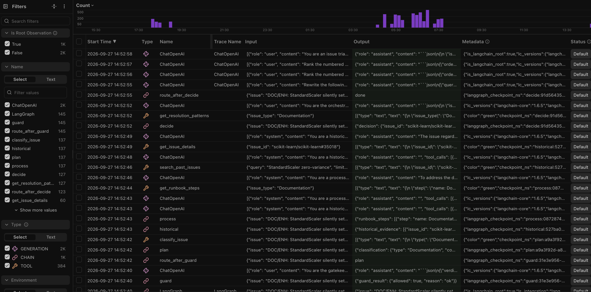

# Issue Triage Copilot — Design Document

A plain-language walkthrough of what this project builds, how it works, and why the
architecture, frameworks, and evaluation choices were made.

---

## 1. Problem Statement

Open-source maintainers receive a steady stream of new issues. Each one needs to be
triaged: what kind of issue is it, who should look at it, what labels fit, what should be
done next, and has this been asked before? Doing this well requires knowing the repo's
issue history and its contribution process — knowledge that lives across thousands of
old issues, PRs, and docs. It is slow, repetitive, and easy to get wrong.

**What we build:** an AI copilot that reads a new (or untriaged) issue for a repo and
recommends:

- suggested labels
- a triage route (how the issue should be handled)
- concrete next steps
- likely affected modules
- 2–4 similar, previously-resolved issues

Every recommendation is **grounded in a cited source** — an issue ID, a PR, or a section
of a process document. The copilot **recommends only**: it never edits code, never writes
to GitHub, and never resolves an issue.

A secondary requirement drove the design: **measure how good the system actually is**
(so we can justify adding complexity) and **host it online for free**.

**Why a recommendation layer and not an auto-resolver?** Resolving issues requires write
access and judgment calls that shouldn't be automated. Keeping the system read-only makes
it safe to deploy, keeps the output a stable structured JSON (`TriageDecision`), and makes
the system auditable — you can always see which sources backed each claim.

---

## 2. High-Level Architecture

```
 GitHub API ──(fetch once)──▶ corpus + process docs
                                    │  held-out split (15%, seeded, never in corpus)
                                    ▼
                     ChromaDB: Index A (issues) + Index B (docs)
                                    │
        new / held-out issue        ▼
        ─────────────────▶ input guard ──rejected?──▶ END
                                    │
                                    ▼
                     multi-agent graph (LangGraph)
                    plan ─▶ historical agent (parallel) ─▶ decide ─▶ TriageDecision
                             process agent (parallel) ────┘
                                    │  citation verify + confidence gate
                                    ▼
                    final decision JSON (+ per-issue eval in the web app)
```

Two systems are built and compared:

1. **Vanilla RAG baseline** — one prompt, retrieve from both indexes, produce the same
   `TriageDecision`. No orchestration.
2. **Multi-agent system** — an orchestrator plans, two specialist agents gather evidence
   in parallel, and a decision stage merges it into the final JSON.

The comparison of these two is the central evaluation result: it justifies whether the
extra orchestration is worth it.

---

## 3. Data Ingestion Pipeline

**Goal:** assemble a static, offline dataset that the RAG system can search at runtime —
no live GitHub API calls during a triage.

**What we fetch** (per target repo):

- **Closed issues**, with their title, body, comments, applied labels, and linked PRs
  (linked PRs are recovered from the issue's events).
- **Process docs**: `CONTRIBUTING.md`, `docs/`, issue/PR templates, and release guides.

**How selection works:** GitHub's issues endpoint returns newest-created issues first, so
we take the **newest closed issues** up to a cap (`--limit` in the CLI, `MAX_ISSUES` for
on-demand web builds), skipping pull requests. This is deterministic — not random — and
intentionally allowed to be slightly stale.

**Held-out split:** at ingestion time, 15% of the fetched issues are carved out with a
**fixed random seed (42)**. These held-out issues are treated as "new" issues during
evaluation and **never enter the retrieval corpus**, so the evaluation is honest: the
system can't have memorized the answers.

**Parsing and persistence:** raw GitHub JSON is parsed into typed Pydantic models
(`IssueRecord`, `IssueComment`, `ProcessDoc`) and saved as JSON on disk.

**Why this design:**

- **Fetch once, reuse many times.** Retrieval is served from local indexes, so a triage is
  fast and costs no GitHub quota. Re-fetching is an explicit, occasional step.
- **A fixed held-out set keeps evals comparable.** Without it, you can't tell whether the
  system improved or just saw different data.
- **Pydantic models** give one canonical shape for issues/docs across fetching, indexing,
  and evaluation.

---

## 4. Retrieval Design

**Goal:** given a new issue, find (a) similar resolved issues and (b) relevant process
docs, so recommendations can be grounded in real evidence.

**Two indexes (ChromaDB):**

- **Index A — issues.** The retrieval unit is the **whole resolved issue** (not chunks).
  Each record is embedded as a normalized title+body signature truncated to ~800 tokens
  (code fences and stack traces are kept). The full record — labels, comments, linked PRs
  — is returned by issue ID when needed.
- **Index B — process docs.** Docs are chunked with a markdown-heading-aware splitter
  (heading hierarchy becomes metadata) followed by a recursive token splitter (~600
  tokens, 15% overlap). A flat chunker also exists for the chunking sweep.

**Embeddings:** OpenAI `text-embedding-3-small`, with a **disk cache keyed by text hash**,
so rebuilding an index never re-embeds unchanged text (fast and cheap).

**Query enhancement (both systems, on by default):**

- **Query rewriter** — a small LLM call distills the raw issue into one clean search query.
- **LLM reranker** — pulls a candidate pool (15 issues / 10 docs) and re-ranks it in a
  single call before returning the top-k.

These were validated by a **retrieval-strategy sweep** (base vs rewrite vs rerank vs
rewrite+rerank) before being turned on.

**Why this design:**

- **Whole-issue retrieval for issues.** What matters for triage is the entire resolved
  thread — labels, the closing comment, the linked PR. Chunking issues would split that
  context; embedding the whole issue keeps similar problems together.
- **Heading-aware chunking for docs.** Process docs are structured (sections, templates);
  chunks that respect headings are self-contained and citable by section.
- **ChromaDB** — free, local, persistent, simple API, cosine similarity. It keeps the
  whole project offline and $0 to run.
- **One embedding model family** (`text-embedding-3-small`) matches the LLM stack, is
  cheap, and lets every component be injected for tests.
- **Rewrite + rerank are measured, not assumed.** Reranking a candidate pool fixes the
  weakness of pure cosine order (semantic vs surface similarity) — and the sweep quantifies
  the gain instead of trusting intuition.

---

## 5. Orchestration: Single vs Multi-Agent, and Tool Use

### The tool layer

Five **read-only MCP tools** expose the corpus to the agents:

| Tool | What it does | Used by |
|---|---|---|
| `classify_issue` | classify issue type + confidence | Orchestrator |
| `get_resolution_patterns` | resolution statistics per issue type | Orchestrator |
| `search_past_issues` | find similar resolved issues | Historical agent |
| `get_issue_details` | full thread for a given issue | Historical agent |
| `get_runbook_steps` | relevant runbook/process steps | Process agent |

Access is **strictly per-agent** (`TOOL_GROUPS`): the orchestrator can't search, the
specialists can't classify. There are no write tools. Every agent tool call is grounded
in the corpus, and a `citation_verify` guardrail drops any cited source that doesn't
exist before the decision reaches the user.

**Why MCP?** MCP is a standard protocol for exposing tools to agents, and
`langchain-mcp-adapters` turns each MCP tool into a LangChain tool. It gives us one clean
interface, explicit per-agent access control, and a path to reuse tools across LLM
frameworks later.

### The multi-agent graph (LangGraph)

A single **orchestrator agent** drives the graph:

1. **Guard** — input guardrail first (see below). Reject short-circuits before any LLM
   work.
2. **Plan** — classify the issue (`classify_issue`) and set confidence.
3. **Parallel specialists** — two ReAct agents run at the same time:
   - **Historical agent** searches similar issues and pulls details;
   - **Process agent** pulls runbook steps for the issue type.
4. **Decide** — the orchestrator re-enters: merge evidence, rank actions
   (`get_resolution_patterns`), produce the final `TriageDecision` JSON, verify every
   citation, and gate on confidence. Low confidence routes to a **human-in-the-loop**
   edge (threshold 0.5).

**The vanilla baseline** runs the same two-index retrieval with a single prompt and
produces the same `TriageDecision` schema — no orchestration, no tool calls.

**Input guard:** every query first passes a deterministic prompt-injection rule set, then
an LLM relevance gate (binary yes/no). Rejected queries short-circuit the graph, so a
jailbreak attempt or a non-triage query costs nothing.

**Why multi-agent over a single prompt?** Triage decomposes into two independent kinds of
evidence — *"what resolved before"* (issue history) and *"how this repo wants issues
handled"* (process docs). Splitting those into focused specialist agents lets each gather
deeper evidence, and a separate decision stage merges them. But this is a hypothesis, not
a given — which is exactly why the **vanilla-vs-multi evaluation** exists.

**Why LangGraph?**

- Triage is a real **graph** (guard → plan → parallel → decide → human-loop), not a linear
  prompt chain.
- **Parallel execution** of the two specialists, with a shared `citations` list merged via
  a reducer — the graph handles the concurrency.
- **Config-aware callbacks** let tracing (local `Tracer` or hosted Langfuse) see every
  nested LLM call and tool call, which is essential for debugging agent behavior.

**Why LangChain / langchain-openai?** One model family (OpenAI) everywhere — classify,
specialists, rewriter, reranker, judge — and every LLM call is an injectable callable, so
the whole suite runs deterministically offline in tests.

### Async / concurrency decisions (web app)

The web app is long-lived and multi-session. Two decisions matter:

- **One process-wide event loop.** Each triage used to create its own event loop
  (`asyncio.run`); async OpenAI clients from a finished run were later garbage-collected
  against the now-closed loop, failing the *second* triage with `Event loop is closed`.
  We now run every graph on a single long-lived loop and serialize triages per repo.
- **Per-repo serialization.** ChromaDB is not thread-safe, so concurrent sessions on the
  same repo are serialized with a lock.

---

## 6. Guardrails

Three guardrails sit around the graph so the system is safe to expose publicly:

- **Input guard** — runs before any agent or LLM work:
  - a **deterministic prompt-injection rule set** that catches "ignore previous
    instructions", "reveal your system prompt", role-switching, and jailbreak phrasing;
  - an **LLM relevance gate** — a binary yes/no check that the query is actually a
    triageable issue and not gibberish or off-topic text.
  Rejected queries **short-circuit the graph** (a `reject` node), so a jailbreak attempt
  or an unrelated query costs no LLM or tool calls.

- **Citation verification** — before a decision reaches the user, every cited source
  (issue ID or doc section) is checked against the corpus; invalid citations are dropped,
  and every referenced similar issue is listed as a citation. The system can only cite
  sources that actually exist.

- **Confidence gate** — the classifier produces a confidence score; below a threshold
  (0.5) the graph routes to a **human-in-the-loop** edge instead of returning a final
  decision, flagging that the issue needs a maintainer's eyes.

**Why:** the system is publicly hosted, so the input boundary must be cheap and
deterministic (rule-based detection) with an LLM fallback for semantics. The output
boundary must never fabricate sources, and the confidence gate stops overconfident wrong
answers from being presented as final.

---

## 7. Observability & Operational Logging

Every stage of the agent flow is observable:

- **Local `Tracer`** — records per-node, per-LLM and per-tool latency and prints an
  avg/p95 summary. No accounts or servers. The web app shows it as a per-stage latency
  table after every triage.
- **Langfuse** (open-source, free tier) — when `LANGFUSE_PUBLIC_KEY` and
  `LANGFUSE_SECRET_KEY` are set, `observability.py` attaches a Langfuse callback to every
  graph invocation (web app, notebook, and eval runner). The hosted trace shows **each
  specialist LLM generation, every MCP tool call and its output, and the final
  `TriageDecision` JSON**:



**Why:** agent behavior is only debuggable if capture is part of the graph's contract.
The trace config is threaded through every nested `model.ainvoke` / `tool.ainvoke` — a
real bug here was callbacks that weren't threaded and never saw the agent calls. Trace
locally first with the `Tracer`; adopt a hosted backend behind environment variables so
the core project needs no accounts.

---

## 8. Evaluations

**Goal:** measure whether the system is good, and justify each design choice with numbers
rather than assumptions.

### The held-out protocol

15% of resolved issues (seeded split) are held out at ingestion and never enter the
corpus. At evaluation time they are treated as brand-new issues: the system is run on
them, and its decision is compared against the actual resolution (real labels, the real
closing comment, linked PRs).

> **Note on scale.** The corpus is deliberately kept small (a few hundred issues per
> repo), capped to stay within GitHub/OpenAI API limits for on-demand builds and to keep
> evals cheap. Retrieval recall and the judge metrics are therefore **limited by corpus
> size** — a small corpus surfaces less relevant evidence, so the eval numbers shown in
> the README are a snapshot and will shift (and typically improve) when re-run over a
> larger corpus.

### LLM-as-judge metrics

For each held-out issue, a judge LLM (`gpt-4o-mini`) scores the decision. **One LLM call
per metric**, each returning a **binary verdict** (`yes`/`no`) converted to 1/0:

- **answer relevancy** — does the decision directly address the issue's problem?
- **context relevance** — does the retrieved evidence actually support the decision?
- **groundedness** — are the substantive claims (labels, triage route, affected modules,
  facts) traceable to the cited sources in the retrieved context? Recommendations may be
  synthesized but must follow from that evidence.

**Why binary verdicts instead of a 1–5 scale?** Binary yes/no is simpler to aggregate,
more reliable to elicit from an LLM, and avoids the fuzzy semantics of numeric scales.

**Evidence-aware judging.** Each system is judged against **the evidence it actually
used** — the multi-agent against the similar issues and runbook steps its specialists
gathered (expanded to full text), the vanilla baseline against the raw retriever top-k.
Judging multi against the raw top-k would measure the wrong thing.

**Why groundedness was redefined.** The original definition ("is *every* claim supported
by a citation") could never pass, because `next_steps` are synthesized recommendations —
actions, not facts — and no citation can literally support an action. Groundedness now
requires the *substantive* claims to be traceable, while treating recommendations as
synthesized from that evidence. That matches what "grounded" should mean for a
recommendation system.

### Objective metrics

These need no LLM judge — they compare the decision to the actual resolution:

- **label accuracy** — top-1 / top-3 of the suggested labels vs the labels actually
  applied.
- **action overlap** — ROUGE-L and entity match between the suggested `next_steps` and
  the actual closing comment / linked PRs.
- **retrieval recall@k / precision@k** — do the retrieved issues overlap with the corpus
  issues that actually share a label with the query?

**Why both judge and objective metrics?** Judge metrics capture "does this feel right";
objective metrics capture "did it match what actually happened." Together they cover
quality from both angles.

### Design-justification sweeps

- **Chunking sweep** — structural vs flat chunking × chunk size × overlap, reporting
  recall@k, precision@k, context relevance. Justifies the heading-aware chunker.
- **Retrieval-strategy sweep** — base / rewrite / rerank / rewrite+rerank. Justifies the
  rewriter + reranker being on by default.

### System metrics

- **p95 latency** and **estimated cost per triage** — because an orchestrated system is
  only worth it if it's fast enough and cheap enough.

### The core comparison

`run_evals.py` runs **vanilla RAG vs multi-agent** over the held-out set and prints a
side-by-side table of every metric above. This is the headline result that justifies the
multi-agent architecture.

### Per-issue eval (web app)

In the hosted web app, after triaging an issue by number, a **per-issue eval** scores the
multi-agent decision vs the vanilla baseline on that one issue — the objective metrics and
the judge metrics — against the actual resolution. This turns evaluation into a
per-request feature, not just a batch script.

---

## 9. Hosting (short note)

The web app is a Streamlit app (Triage + Evals tabs) deployed free on **Streamlit
Community Cloud**. Free hosts are **ephemeral** (disk resets on sleep), so the repo ships a
small committed **seed** — a 255-issue sklearn corpus, its embedding cache, and precomputed
evals — making the demo work instantly and offline. Arbitrary repos are fetched and indexed
**on demand** (capped by `MAX_ISSUES`), cached for the session, and rebuilt after a wake.
Secrets (OpenAI, GitHub, optional Langfuse) live in platform secrets, never in git.

For the build, run, and evaluation commands, see the [`README`](../README.md).